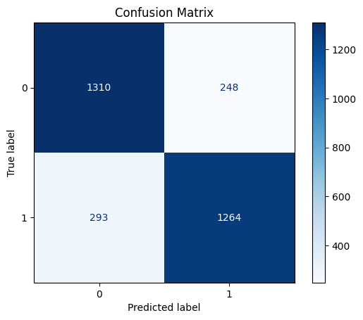
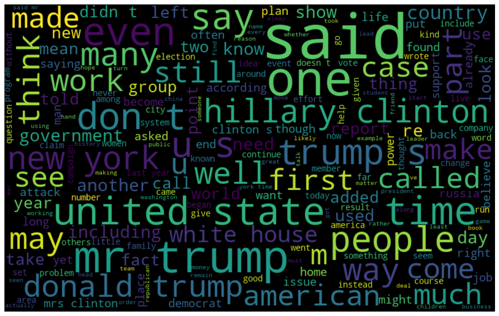

# Fake News Detection with NLP

### Author: Virendrasinh Chavda

This repository contains a machine learning-powered web application for detecting fake news based on textual input. The project aims to identify the authenticity of news articles using Natural Language Processing (NLP) and machine learning models, presenting the results via an intuitive user interface.

---

## Table of Contents
1. [Overview](#overview)
2. [Installation](#installation)
3. [Data](#data)
4. [Features](#features)
5. [Methodology](#methodology)
6. [Results](#results)
7. [Future Work](#future-work)
8. [Contributing](#contributing)
9. [License](#license)

---

## Overview

In an era where misinformation spreads rapidly, detecting fake news is more critical than ever. This project leverages machine learning and NLP to distinguish between fake and real news articles. The system is trained using labeled data and provides predictions via a streamlined web application.

The application uses <strong>scikit-learn</strong> for building and training the machine learning pipeline, and visualizations like confusion matrices and word clouds to explain the results. The interface is designed for easy use by both technical and non-technical users.

---

## Installation

To set up the project, install the required Python dependencies listed in `requirements.txt`. Open the Jupyter Notebook (`Fake news detection.ipynb`) to execute the code and explore the results interactively.

---

## Data

The dataset used for this project is preprocessed and stored in a structured format. Key features include:

- <strong>Text</strong>: The content of the news article.
- <strong>Label</strong>: A binary classification where `1` indicates fake news and `0` indicates real news.

The dataset undergoes text preprocessing steps such as tokenization, stopword removal, and vectorization before being fed into the machine learning pipeline.

---

## Features

### Machine Learning Model
- Uses a pre-trained classification model to identify fake news.
- Processes text data using NLP techniques like TF-IDF vectorization.

### Visualizations
- <strong>Confusion Matrix</strong>: Displays model performance.
- <strong>Word Cloud</strong>: Highlights the most common words in the dataset for both real and fake news.

### Interactive Application
- Jupyter Notebook serves as the main interface for executing the model and exploring results.

---

## Methodology

1. <strong>Data Preprocessing</strong>:
   - Cleaned and prepared the dataset for model training.
   - Tokenized text and removed stopwords.
   - Transformed text data into numerical features using TF-IDF vectorization.

2. <strong>Model Training</strong>:
   - Split the data into training and test sets.
   - Trained a classification model using scikit-learn.
   - Evaluated the model with metrics like accuracy, precision, recall, and F1-score.

3. <strong>Visualization</strong>:
   - Generated a confusion matrix to illustrate classification performance.
   - Created word clouds to provide insights into the dataset's textual patterns.

---

## Results

The machine learning model demonstrates robust performance, achieving high accuracy on the test dataset. Below are key visualizations:

### Confusion Matrix
The confusion matrix below illustrates the model's classification performance:

### Word Cloud
Word clouds highlight the most frequent words in the dataset, offering insights into textual features for both fake and real news articles:

---

## Future Work

1. <strong>Model Enhancement</strong>:
   - Experiment with deep learning models like LSTM or BERT for improved performance.

2. <strong>Feature Expansion</strong>:
   - Include metadata such as source credibility, publication date, and author information.

3. <strong>Deployment</strong>:
   - Develop a web-based interface using frameworks like Flask or Streamlit for broader accessibility.

---

## Contributing

Contributions are welcome! Feel free to fork the repository, make improvements, and submit a pull request. If you encounter any issues, please open a GitHub issue for discussion.

---

## License

This project is licensed under the MIT License. See the [LICENSE](./LICENSE) file for more details.
